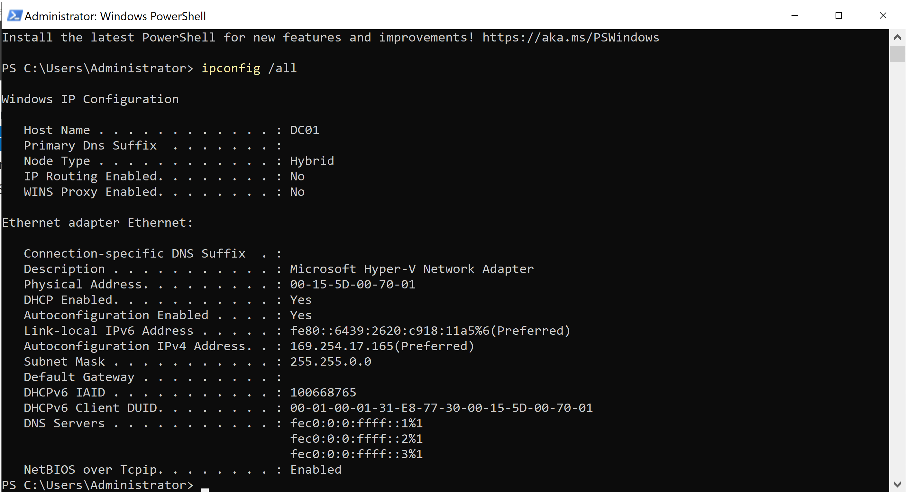
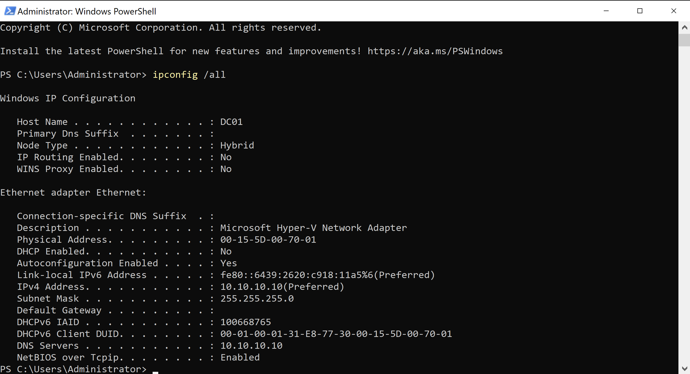
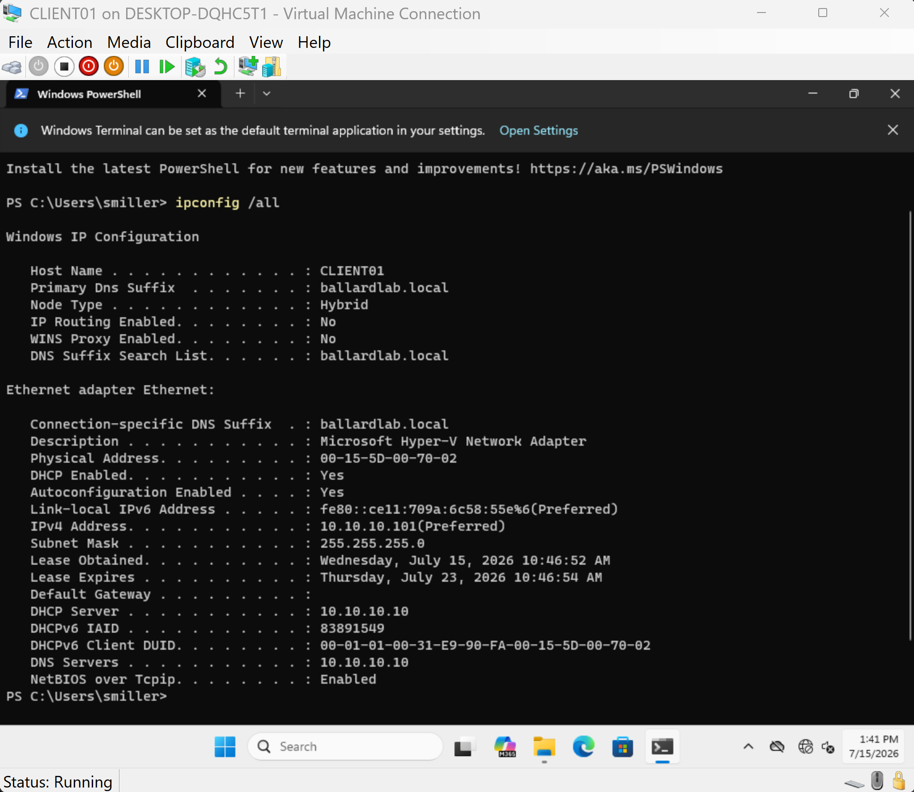

# Network Design

## Overview

BallardLab runs on an isolated Microsoft Hyper-V virtual network named `BALLARDLAB-LAN`.

The network was designed to support Windows domain services without exposing the lab DHCP server to the physical home network.

```text
BALLARDLAB-LAN
10.10.10.0/24
        |
   +----+----+
   |         |
 DC01     CLIENT01
```

## Hyper-V Virtual Switch

`BALLARDLAB-LAN` uses an **Internal** Hyper-V virtual switch.

This provides network connectivity between:

- Hyper-V virtual machines
- The Windows 11 Hyper-V host

The switch does not bridge directly to the physical network.

An Internal switch was selected instead of an External switch to keep the lab DHCP environment isolated from the home LAN.

Running the BallardLab DHCP server on the same broadcast domain as the home DHCP server could result in clients receiving network configuration from the wrong DHCP service.

## IPv4 Addressing

The lab uses:

```text
Network:     10.10.10.0/24
Subnet Mask: 255.255.255.0
```

### DC01

```text
Hostname:    DC01
IPv4:        10.10.10.10
Subnet Mask: 255.255.255.0
Gateway:     None
DNS:         10.10.10.10
```

DC01 uses a static IPv4 address because it provides infrastructure services that clients must locate predictably.

The default gateway is intentionally blank because no router currently exists on the isolated lab subnet.

DC01 points to its own IP address for DNS because it hosts the Active Directory DNS service for `ballardlab.local`.

### Initial APIPA State

Before static IPv4 configuration, DC01 assigned itself an Automatic Private IP Address in the `169.254.0.0/16` range because no DHCP service was available on the isolated network.



The server was then manually configured with the static address `10.10.10.10/24` and configured to use itself as the internal DNS server.



## Client Addressing

CLIENT01 is configured as a DHCP client.

The DHCP client range is:

```text
10.10.10.100 - 10.10.10.200
```

Lower IPv4 addresses are reserved for statically configured servers and future infrastructure devices.

After DHCP configuration, CLIENT01 received:

```text
IPv4 Address: 10.10.10.101
Subnet Mask:  255.255.255.0
DNS Server:   10.10.10.10
DNS Suffix:   ballardlab.local
```

No default gateway is distributed because the lab currently has no routed connection to another network.

The resulting client network configuration was validated using `ipconfig /all`.



## APIPA Validation

Before DHCP was available, both server and client configuration testing exposed Automatic Private IP Addressing behavior.

CLIENT01 received a `169.254.x.x` address while configured as a DHCP client with no available DHCP server.

This indicated that the client failed to obtain a DHCP lease and self-assigned a link-local IPv4 address.

After the DHCP service was deployed and an active scope was configured, CLIENT01 successfully obtained valid BallardLab network configuration.

The behavior demonstrated the difference between a self-assigned APIPA address and valid network configuration received from an authorized DHCP server.

## Design Notes

This environment intentionally consolidates AD DS, DNS, and DHCP services on DC01 to reduce the virtual machine footprint of the training lab.

A production environment may separate infrastructure roles based on availability, scale, security, and operational requirements.

The `ballardlab.local` namespace is used only for the isolated lab. A production Active Directory deployment would typically use a registered domain or delegated subdomain such as:

```text
ad.example.com
```

## Validation

The network configuration was validated using:

```powershell
ipconfig /all
```

Validation confirmed that:

- DC01 uses the static infrastructure address `10.10.10.10`
- CLIENT01 is configured as a DHCP client
- CLIENT01 received `10.10.10.101/24`
- DHCP service was provided by `10.10.10.10`
- CLIENT01 uses `10.10.10.10` for internal DNS
- The `ballardlab.local` DNS suffix was assigned to the client
- No default gateway was configured on the isolated subnet

CLIENT01 successfully received DHCP configuration from DC01 and was able to communicate with the server across the local subnet.

DNS and Active Directory service discovery validation are documented separately in:

[DHCP and DNS](03-dhcp-dns.md)
