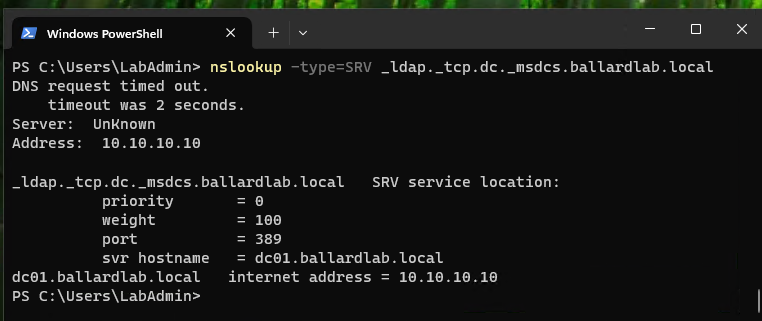

# Active Directory

## Overview

BallardLab uses Active Directory Domain Services (AD DS) to provide centralized identity and directory services for the Windows domain environment.

A new Active Directory forest was deployed with the domain:

```text
ballardlab.local
```

DC01 was promoted as the first domain controller in the forest and hosts the Active Directory database and domain services for the lab.

```text
Forest:            ballardlab.local
Domain:            ballardlab.local
NetBIOS Name:      BALLARDLAB
Domain Controller: DC01
```

## Domain Controller Deployment

The Active Directory Domain Services role was installed on DC01 before the server was promoted to a domain controller.

A new forest was created using:

```text
Domain Name:        ballardlab.local
NetBIOS Name:       BALLARDLAB
DNS Installation:   Enabled
```

The domain controller promotion also installed DNS services required for Active Directory name resolution and service discovery.

After promotion and restart, domain administrative authentication used the BALLARDLAB domain context rather than the original standalone server account context.

The completed deployment established DC01 as the domain controller for the new `ballardlab.local` forest.


## Organizational Unit Structure

Organizational Units were created to organize directory objects by administrative and business function.

```text
BallardLab
|
+-- Users
|   +-- Finance
|   +-- Operations
|
+-- Groups
    +-- Global
    +-- Domain Local
```

The Finance and Operations OUs contain user objects associated with each department.

Security groups are organized separately by group scope.

This structure separates object organization from resource authorization.

An OU determines where an object is administratively organized and can affect Group Policy application.

Security group membership determines access paths to protected resources.


## Domain User Accounts

Two domain user accounts were created to validate department-based access control.

### Finance

Sarah Miller was initially created as a Finance user for the first access-control validation scenario.

```text
Name:       Sarah Miller
Username:   smiller
Department: Finance
```

### Operations

```text
Name:       Olivia Davis
Username:   odavis
Department: Operations
```

The accounts were initially placed in their corresponding department OUs.

These users were used to perform both positive and negative access testing against departmental file shares.

Sarah was later transferred from Finance to Operations as part of a role-change lifecycle test. The role transfer and resulting Group Policy behavior are documented in:

[Group Policy and Role-Based Drive Mapping](05-group-policy.md)

## Global Security Groups

Role-based Global security groups were created:

```text
GG-Finance-Users
GG-Operations-Users
```

User accounts are assigned to a Global group based on their organizational role.

The initial Finance configuration used:

```text
Sarah Miller
      |
GG-Finance-Users
```

The Operations configuration used:

```text
Olivia Davis
      |
GG-Operations-Users
```

Global groups answer the administrative question:

> Who are these users?

For example, `GG-Finance-Users` represents users performing the Finance role.

Resource permissions are not assigned directly to individual user accounts.

The Global security groups were created separately from resource permission groups to preserve role-based administration.


## Domain Local Security Groups

Resource-specific Domain Local groups were created:

```text
DL-Finance-Share-Modify
DL-Operations-Share-Modify
```

These groups represent access to specific resources.

Domain Local groups answer the administrative question:

> What access does this group receive?

The role-based Global groups were nested into the appropriate resource groups.

```text
GG-Finance-Users
        |
DL-Finance-Share-Modify
```

```text
GG-Operations-Users
        |
DL-Operations-Share-Modify
```

The Domain Local groups are then assigned permissions on the corresponding NTFS resources.


## AGDLP Design

BallardLab uses the AGDLP access-control model:

```text
A - Accounts
G - Global Groups
DL - Domain Local Groups
P - Permissions
```

The initial Finance access path was:

```text
Sarah Miller
    |
GG-Finance-Users
    |
DL-Finance-Share-Modify
    |
NTFS Modify
    |
\\DC01\Finance
```

Sarah's initial membership in the Finance Global security group was validated directly in Active Directory.


The Operations access path is:

```text
Olivia Davis
    |
GG-Operations-Users
    |
DL-Operations-Share-Modify
    |
NTFS Modify
    |
\\DC01\Operations
```

This design separates user role membership from resource permission assignment.

The relationship can be summarized as:

```text
Account
   |
Global Role Group
   |
Domain Local Resource Group
   |
NTFS Permission
```

For example, if Sarah Miller transfers from Finance to Operations, the resource ACL does not need to be modified.

Her Active Directory group memberships can be changed:

```text
Remove: GG-Finance-Users
Add:    GG-Operations-Users
```

Her user object can also be moved from the Finance OU to the Operations OU to reflect the administrative change and allow department-specific Group Policy to apply appropriately.

The existing Finance and Operations NTFS ACLs remain unchanged because permissions are assigned to Domain Local resource groups rather than directly to Sarah's user account.

## Access Tokens and Group Membership

When a domain user authenticates to CLIENT01, Windows builds an access token containing the user's security identifiers and applicable security group memberships.

For the initial Finance user configuration, the authorization path included membership through:

```text
GG-Finance-Users
        |
DL-Finance-Share-Modify
```

When the user accesses the Finance resource, Windows evaluates the security principals in the user's token against the resource access control list.

The NTFS ACL contains:

```text
DL-Finance-Share-Modify -> Modify
```

Because the user's nested group membership maps to an allowed security principal, access is granted.

After security group membership changes, an existing user session may continue using an access token created before the change.

Running:

```powershell
gpupdate /force
```

reprocesses Group Policy but does not rebuild the user's existing Windows logon access token.

Signing out and signing back in creates a new logon session and access token using current Active Directory group membership.

This behavior was directly observed during Sarah Miller's Finance-to-Operations role transfer.

The resulting token validation is documented in:

[Group Policy and Role-Based Drive Mapping](05-group-policy.md)

## Domain Client

CLIENT01 was joined to:

```text
ballardlab.local
```

The domain join process depended on internal DNS to locate Active Directory domain controller services.

Active Directory domain controller discovery was validated using the LDAP SRV record:

```text
_ldap._tcp.dc._msdcs.ballardlab.local
```

The DNS response identified:

```text
dc01.ballardlab.local
Port: 389
Address: 10.10.10.10
```



After the domain join, users authenticated using domain identities such as:

```text
BALLARDLAB\smiller
BALLARDLAB\odavis
```

rather than the original CLIENT01 local administrator account.

The successful domain join also created a CLIENT01 computer object in Active Directory and established a trust relationship between the workstation and the domain.

## Validation

The Active Directory design was validated by:

- Deploying a new `ballardlab.local` Active Directory forest
- Promoting DC01 as the first domain controller
- Creating a structured OU hierarchy
- Creating departmental domain user accounts
- Creating role-based Global security groups
- Creating resource-specific Domain Local security groups
- Nesting Global groups into Domain Local groups
- Validating the AGDLP authorization path
- Joining CLIENT01 to the domain
- Validating LDAP SRV-based domain controller discovery
- Authenticating domain users on CLIENT01
- Confirming security group membership
- Accessing SMB resources using domain identities
- Testing authorized departmental access
- Testing unauthorized cross-department access
- Changing a user's departmental role without modifying resource ACLs
- Validating refreshed group membership through a new Windows logon token

The detailed NTFS and SMB authorization implementation is documented in:

[Access Control](04-access-control.md)

The Group Policy and user role-transfer lifecycle is documented in:

[Group Policy and Role-Based Drive Mapping](05-group-policy.md)
