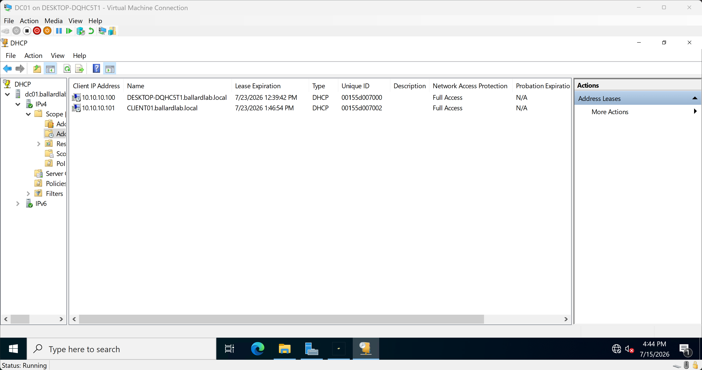

# DHCP and DNS

## Overview

DC01 provides DHCP and Active Directory-integrated DNS services for the BallardLab network.

```text
Server:  DC01
IPv4:    10.10.10.10
Domain:  ballardlab.local
```

DHCP provides dynamic IPv4 configuration to domain clients.

DNS provides internal name resolution and allows clients to discover Active Directory services published through DNS service records.

## DHCP Server Deployment

The DHCP Server role was installed on DC01.

After installation, the DHCP server was authorized in Active Directory before servicing domain clients.

Installing the DHCP role provides the server with DHCP functionality, while Active Directory authorization provides an administrative control for Windows DHCP servers operating in an Active Directory domain.

An Active Directory-aware Windows DHCP server checks its authorization status before providing DHCP services in the domain environment.

This authorization mechanism helps prevent unauthorized Windows DHCP servers from servicing domain clients.

DHCP authorization does not replace network-level protections against every possible rogue DHCP implementation. Additional controls such as DHCP snooping may be used on managed switching infrastructure in production environments.

## DHCP Scope

A DHCP scope was configured for the BallardLab client network.

```text
Network:      10.10.10.0/24
Subnet Mask:  255.255.255.0
Scope Start:  10.10.10.100
Scope End:    10.10.10.200
```

The lower portion of the subnet is left outside the dynamic scope.

```text
10.10.10.1 - 10.10.10.99
```

This provides address space for statically configured infrastructure such as servers and future network devices.

DC01 uses:

```text
10.10.10.10
```

and is therefore outside the DHCP client pool.

The DHCP management console was used to verify active client leases within the configured scope.



The lease table confirmed dynamic address assignment to both CLIENT01 and the Hyper-V host virtual network adapter connected to `BALLARDLAB-LAN`.

## DHCP Options

The scope provides clients with internal DNS configuration.

```text
DNS Server: 10.10.10.10
DNS Domain: ballardlab.local
```

A default gateway is not currently distributed because `BALLARDLAB-LAN` is an isolated subnet with no router providing connectivity to another network.

CLIENT01 and DC01 are both located on:

```text
10.10.10.0/24
```

Because both systems are on the same IPv4 subnet, they can communicate directly without forwarding traffic through a default gateway.

## APIPA Troubleshooting

Before DHCP was configured, CLIENT01 was set to obtain an IPv4 address automatically.

No DHCP server was available on `BALLARDLAB-LAN`.

The client assigned itself an Automatic Private IP Addressing address in:

```text
169.254.0.0/16
```

This indicated that the client did not successfully receive DHCP configuration.

The troubleshooting path was:

```text
APIPA detected
      |
      v
Verify client virtual switch connectivity
      |
      v
Verify DHCP service and authorization
      |
      v
Verify active DHCP scope and address availability
```

After the DHCP role was installed, the server was authorized, and the client scope was activated, valid DHCP leases were issued.

The transition from APIPA to a valid `10.10.10.0/24` address provided a direct validation that CLIENT01 could discover and receive configuration from the DHCP service on DC01.

## DHCP Lease Validation

CLIENT01 received:

```text
IPv4 Address: 10.10.10.101
Subnet Mask:  255.255.255.0
DHCP Server:  10.10.10.10
DNS Server:   10.10.10.10
DNS Suffix:   ballardlab.local
```

The configuration was validated using:

```powershell
ipconfig /all
```


The output confirmed:

- DHCP was enabled on the CLIENT01 Ethernet adapter
- CLIENT01 received `10.10.10.101`
- The DHCP server was `10.10.10.10`
- The DNS server was `10.10.10.10`
- The `ballardlab.local` DNS suffix was assigned
- No default gateway was distributed

This validated that DC01 issued the client network configuration required for the BallardLab domain environment.

During validation, the Hyper-V host also received a DHCP lease on its `BALLARDLAB-LAN` virtual Ethernet adapter.

This behavior was expected because an Internal Hyper-V virtual switch provides connectivity between virtual machines and the Hyper-V host.

The DHCP address lease table showed:

```text
10.10.10.100  DESKTOP-DQHC5T1.ballardlab.local
10.10.10.101  CLIENT01.ballardlab.local
```

Both addresses were dynamically assigned by the DHCP service on DC01.


## Active Directory DNS

Active Directory depends on DNS for domain controller and service discovery.

CLIENT01 was configured to use:

```text
10.10.10.10
```

as its DNS server.

DC01 hosts the DNS zone for:

```text
ballardlab.local
```

Using a public DNS resolver as the client's primary DNS server would prevent the client from resolving private BallardLab records and discovering Active Directory services.

For the domain client, internal DNS is not simply used to translate hostnames into IPv4 addresses.

It also provides the service records CLIENT01 uses to locate Active Directory services.

## Forward DNS Resolution

Forward name resolution was tested from CLIENT01 using:

```powershell
nslookup dc01.ballardlab.local
```

The DNS server returned:

```text
Name:    dc01.ballardlab.local
Address: 10.10.10.10
```

This validated the forward DNS mapping:

```text
dc01.ballardlab.local
          |
          v
     10.10.10.10
```

The hostname is represented by an A record that maps the DNS name to an IPv4 address.

## Active Directory SRV Records

Active Directory uses DNS SRV records to advertise services.

CLIENT01 queried the LDAP domain controller service record using:

```powershell
nslookup -type=SRV _ldap._tcp.dc._msdcs.ballardlab.local
```

The response returned:

```text
Priority:     0
Weight:       100
Port:         389
SRV Hostname: dc01.ballardlab.local
```

DNS also resolved the SRV target:

```text
dc01.ballardlab.local -> 10.10.10.10
```


The service discovery path was:

```text
CLIENT01
    |
    | Which server provides the domain controller
    | LDAP service for ballardlab.local?
    v
DNS SRV Query
    |
    v
dc01.ballardlab.local
    |
    v
DNS A Record
    |
    v
10.10.10.10
```

An SRV record identifies the server providing a specific service.

An A record maps the server hostname to its IPv4 address.

Together, these DNS records allow CLIENT01 to locate DC01 and discover Active Directory services.

This service discovery process is a core dependency of the Active Directory domain environment.

## Reverse DNS Observation

During `nslookup` validation, the output displayed:

```text
Server:  UnKnown
Address: 10.10.10.10
```

The requested forward and SRV lookups still completed successfully.

The DNS server name displayed as `UnKnown` because a reverse lookup zone and PTR record had not been configured for `10.10.10.10`.

This did not prevent forward DNS resolution or Active Directory SRV record queries from succeeding.

The observation was retained as a documented lab limitation rather than treating the successful query response as a DNS failure.

## Domain Join Dependency

CLIENT01 used internal DNS when joining:

```text
ballardlab.local
```

Conceptually, the discovery process was:

```text
CLIENT01 queries DNS
        |
        v
AD SRV records identify DC01
        |
        v
DC01 hostname resolves to 10.10.10.10
        |
        v
CLIENT01 contacts the domain controller
        |
        v
Domain credentials are validated
        |
        v
Computer account and domain trust are established
```

Successful DNS service discovery was validated before CLIENT01 was joined to the domain.

After the domain join, domain users could authenticate to CLIENT01 using `BALLARDLAB` identities.

The Active Directory deployment and domain client configuration are documented in:

[Active Directory](02-active-directory.md)

## Validation Summary

The DHCP and DNS implementation was validated through:

- Identifying APIPA behavior before DHCP availability
- Installing and authorizing the Windows DHCP Server role
- Configuring a `10.10.10.100 - 10.10.10.200` DHCP scope
- Preserving lower subnet addresses for static infrastructure
- Successfully assigning `10.10.10.101` to CLIENT01
- Identifying DC01 as the DHCP server at `10.10.10.10`
- Assigning DC01 as the internal DNS server
- Assigning the `ballardlab.local` DNS suffix
- Verifying active leases through the DHCP management console
- Validating forward DNS resolution
- Querying the Active Directory LDAP SRV record
- Resolving the SRV target to DC01
- Validating domain controller service discovery
- Successfully joining CLIENT01 to `ballardlab.local`

The underlying subnet and Hyper-V switch design are documented in:

[Network Design](01-network-design.md)

The Active Directory identity and domain architecture are documented in:

[Active Directory](02-active-directory.md)
