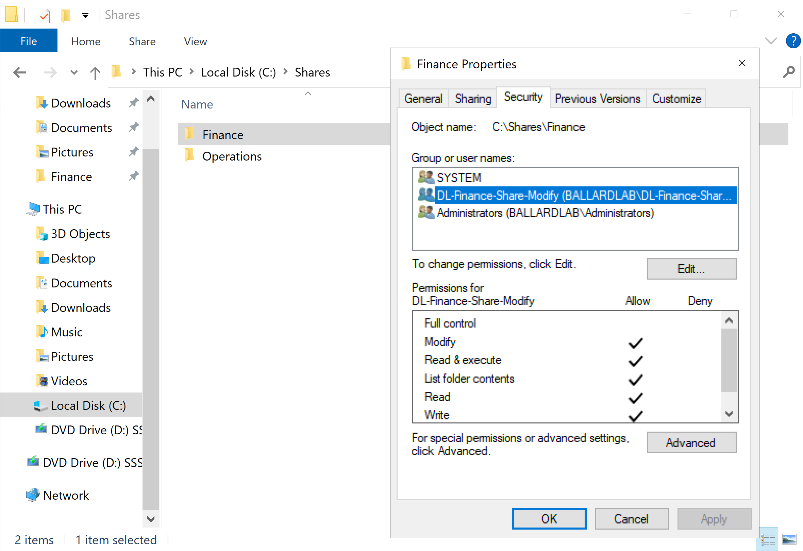
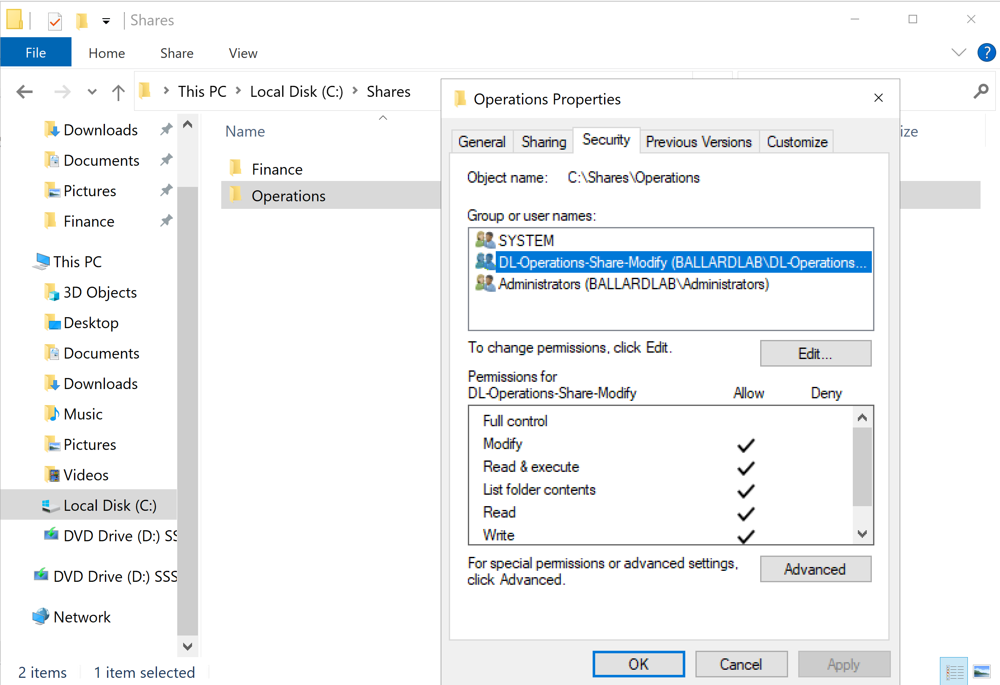
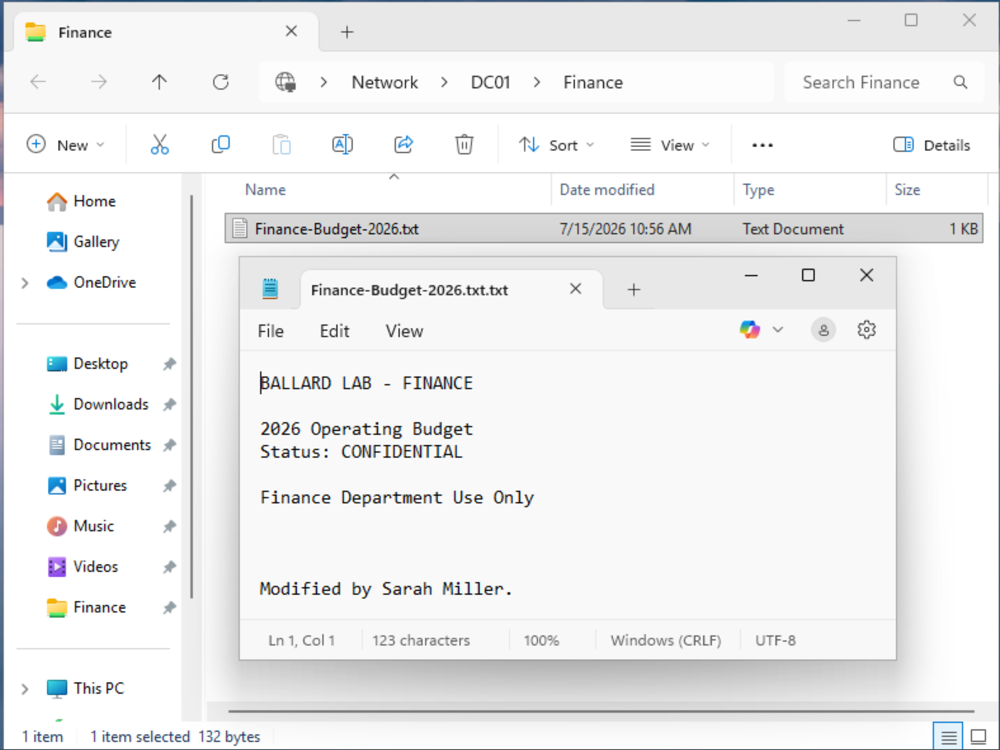
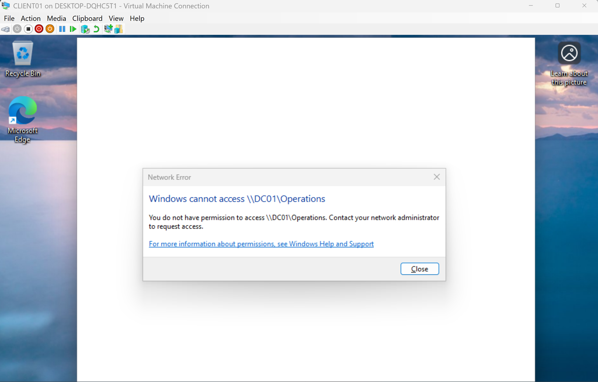

# Access Control

## Overview

BallardLab uses role-based security groups, the AGDLP model, SMB file sharing, and NTFS permissions to control access to departmental resources.

Two department file shares were implemented:

```text
\\DC01\Finance
\\DC01\Operations
```

The access-control design separates:

```text
User Identity
      |
      v
Business Role
      |
      v
Resource Access Group
      |
      v
Resource Permission
```

Permissions are assigned to security groups rather than directly to individual user accounts.

## Department Resources

The department folders are stored locally on DC01 under:

```text
C:\Shares
|
+-- Finance
+-- Operations
```

The folders are exposed to domain clients as SMB shares:

```text
C:\Shares\Finance
        |
        v
\\DC01\Finance
```

```text
C:\Shares\Operations
        |
        v
\\DC01\Operations
```

## AGDLP Permission Model

The environment uses the AGDLP model:

```text
A  = Accounts
G  = Global Groups
DL = Domain Local Groups
P  = Permissions
```

### Initial Finance Access Path

Sarah Miller was initially assigned to the Finance role.

```text
Sarah Miller
    |
    v
GG-Finance-Users
    |
    v
DL-Finance-Share-Modify
    |
    v
NTFS Modify
    |
    v
C:\Shares\Finance
```

### Operations Access Path

Olivia Davis was assigned to the Operations role.

```text
Olivia Davis
    |
    v
GG-Operations-Users
    |
    v
DL-Operations-Share-Modify
    |
    v
NTFS Modify
    |
    v
C:\Shares\Operations
```

Global groups represent organizational roles.

Domain Local groups represent access to specific resources.

NTFS permissions are assigned to the Domain Local resource groups.

This design separates:

```text
Who the user is
        |
        v
Global Group
```

from:

```text
What access is granted
        |
        v
Domain Local Group
```

## NTFS Permission Configuration

NTFS inheritance was disabled on each departmental folder.

Existing inherited permissions were converted to explicit permission entries before broad user access entries were removed.

The resulting permission design retains administrative and system access while granting department access through a resource-specific Domain Local group.

### Finance ACL

The final Finance ACL uses:

```text
SYSTEM                          -> Full Control
BALLARDLAB\Administrators       -> Full Control
DL-Finance-Share-Modify         -> Modify
```



The `DL-Finance-Share-Modify` group receives Modify permission but does not receive Full Control.

### Operations ACL

The final Operations ACL uses:

```text
SYSTEM                          -> Full Control
BALLARDLAB\Administrators       -> Full Control
DL-Operations-Share-Modify      -> Modify
```



The `DL-Operations-Share-Modify` group receives Modify permission but does not receive Full Control.

No individual department user is directly assigned NTFS permission.

For example:

```text
smiller -> No direct ACL entry
odavis  -> No direct ACL entry
```

Access is provided through nested security group membership.

## Why Modify Was Assigned

Department users were assigned the NTFS `Modify` permission rather than `Full Control`.

Modify allows the users to perform the required file operations:

```text
Read
Create
Write
Modify
Delete
```

Full Control would additionally allow users to change permissions and take ownership of resources.

Those administrative capabilities are not required for standard department users.

This follows the principle of least privilege.

The final NTFS configuration therefore provides the operational access department users need without granting administrative control of the resource ACL.

## SMB Share Permissions

The SMB share permission layer was configured with:

```text
Everyone -> Full Control
```

The NTFS ACL is then used to enforce granular resource authorization.

The access path is:

```text
User connects to SMB share
          |
          v
Share permission evaluated
          |
          v
Everyone -> Full Control
          |
          v
NTFS permission evaluated
          |
          v
Applicable resource group?
       /       \
     Yes        No
      |          |
      v          v
   Access     No Allow
   Granted       |
                 v
            Access Denied
```

This design keeps the share permission layer broad while centralizing detailed authorization in the NTFS ACL.

The broad SMB permission does not override restrictive NTFS permissions.

When share and NTFS permissions both apply to network access, the effective result is constrained by both permission layers.

For this lab, the SMB layer exposes the share while NTFS provides the detailed departmental authorization boundary.

## Initial Finance Access Validation

Sarah Miller authenticated to CLIENT01 using:

```text
BALLARDLAB\smiller
```

At the time of the initial validation, her security group path was:

```text
smiller
   |
   v
GG-Finance-Users
   |
   v
DL-Finance-Share-Modify
```

Sarah accessed:

```text
\\DC01\Finance
```

The following operations were tested:

```text
Open existing file     -> Success
Read file              -> Success
Modify file            -> Success
Save changes           -> Success
Create new file        -> Success
Delete test file       -> Success
```

The successful create, edit, and delete operations validated the expected NTFS Modify permission.



The access was provided through nested group membership.

Sarah did not have a direct ACL entry on the Finance folder.

## Operations Access Validation

Olivia Davis authenticated to CLIENT01 using:

```text
BALLARDLAB\odavis
```

Her security group path was:

```text
odavis
   |
   v
GG-Operations-Users
   |
   v
DL-Operations-Share-Modify
```

Olivia accessed:

```text
\\DC01\Operations
```

Validation included:

```text
Open share             -> Success
Create text document   -> Success
Modify document        -> Success
Duplicate document     -> Success
Delete duplicate       -> Success
```

The results validated Modify access to the Operations resource.

## Negative Access Testing

Positive access testing alone does not confirm that an authorization boundary is correctly enforced.

Cross-department access was therefore tested.

### Finance User Against Operations

During the initial Finance role validation, Sarah Miller attempted to access:

```text
\\DC01\Operations
```

Her access path at that time was:

```text
smiller
   |
   v
GG-Finance-Users
   |
   v
No membership in DL-Operations-Share-Modify
   |
   v
No applicable Allow entry on Operations ACL
   |
   v
Access Denied
```

The request returned:

```text
Access Denied
```



Sarah was not explicitly assigned a `Deny` permission.

Access was unavailable because her security group memberships did not map to an allowed security principal on the Operations NTFS ACL.

This distinction is important:

```text
No applicable Allow != Explicit Deny
```

The negative access test confirmed that the departmental authorization boundary was functioning as intended.

## Windows Access Tokens

When a domain user authenticates to CLIENT01, Windows creates an access token containing the user's SID and applicable security group SIDs.

For Sarah's initial Finance role, the token conceptually included:

```text
Sarah authenticates
        |
        v
Windows creates access token
        |
        v
Token contains group SIDs
        |
        +-- GG-Finance-Users
        |
        +-- DL-Finance-Share-Modify
```

When Sarah accessed the Finance folder, the NTFS ACL was evaluated against the security principals represented in her access token.

The ACL contained:

```text
DL-Finance-Share-Modify -> Modify
```

A matching allowed security principal was found and access was granted.

For the Operations folder, Sarah's token did not initially contain membership that mapped to:

```text
DL-Operations-Share-Modify
```

No applicable Allow permission granted access to the resource.

## User Transfer Scenario

The group-based access model was then tested through a departmental transfer scenario.

Example ticket:

> Sarah Miller has transferred from Finance to Operations. Remove Finance access and provide standard Operations access.

The required Active Directory role changes were:

```text
Remove: GG-Finance-Users
Add:    GG-Operations-Users
```

Sarah's user object was also moved:

```text
Finance OU
    |
    v
Operations OU
```

The Finance and Operations folder ACLs did not need to be modified.

The access paths changed through security group membership.

### Previous Role

```text
Sarah
  |
GG-Finance-Users
  |
DL-Finance-Share-Modify
  |
Finance Modify
```

### New Role

```text
Sarah
  |
GG-Operations-Users
  |
DL-Operations-Share-Modify
  |
Operations Modify
```

After the group membership change, Sarah's existing Windows session continued to use the access token created during the previous logon session.

Running:

```powershell
gpupdate /force
```

reprocessed Group Policy but did not rebuild the existing user access token.

Sarah signed out and signed back in to create a new logon session.

The refreshed token contained:

```text
GG-Operations-Users
DL-Operations-Share-Modify
```

The Finance groups were no longer represented in the validated token output.

The complete role-transfer, access-token, and drive-mapping lifecycle validation is documented in:

[Group Policy and Role-Based Drive Mapping](05-group-policy.md)

## Post-Transfer Authorization Validation

After Sarah authenticated with a fresh logon session, her Operations access path was active.

She successfully accessed the Operations share and performed Modify-level file operations.

Her previous Finance access path had been removed.

A direct attempt to access:

```text
\\DC01\Finance
```

returned:

```text
Access Denied
```

This confirmed that changing Sarah's role group memberships updated the effective authorization path without requiring direct changes to either departmental folder ACL.

The NTFS access-control architecture remained unchanged.

Only the user's role membership changed.

## Security Principles Demonstrated

The access-control implementation demonstrates:

- Role-based access control
- AGDLP group nesting
- Least privilege
- Group-based authorization
- Separation of identity roles and resource permissions
- Explicit NTFS ACL management
- SMB and NTFS permission interaction
- Positive authorization testing
- Negative authorization testing
- Windows access token evaluation
- Nested security group authorization
- User access lifecycle management
- Departmental role transfer
- Access removal without direct ACL changes

## Validation Summary

The access-control design was validated through:

- Creating separate Finance and Operations resources
- Creating resource-specific Domain Local security groups
- Nesting departmental Global groups into resource permission groups
- Removing broad inherited NTFS user entries
- Assigning Modify permission to Domain Local groups
- Verifying that Full Control was not granted to department users
- Successfully reading, creating, modifying, and deleting files
- Testing unauthorized cross-department access
- Distinguishing no applicable Allow permission from an explicit Deny entry
- Transferring Sarah from Finance to Operations
- Updating role group membership without modifying folder ACLs
- Refreshing the Windows logon token through sign-out and sign-in
- Validating successful Operations access after the transfer
- Validating denied Finance access after the transfer

## Related Documentation

- [Active Directory](02-active-directory.md)
- [DHCP and DNS](03-dhcp-dns.md)
- [Network Design](01-network-design.md)
- [Group Policy and Role-Based Drive Mapping](05-group-policy.md)
