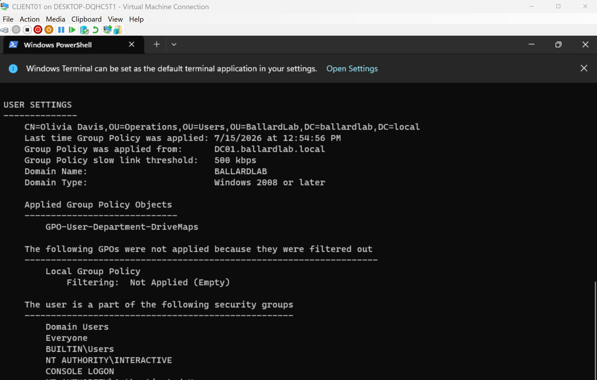
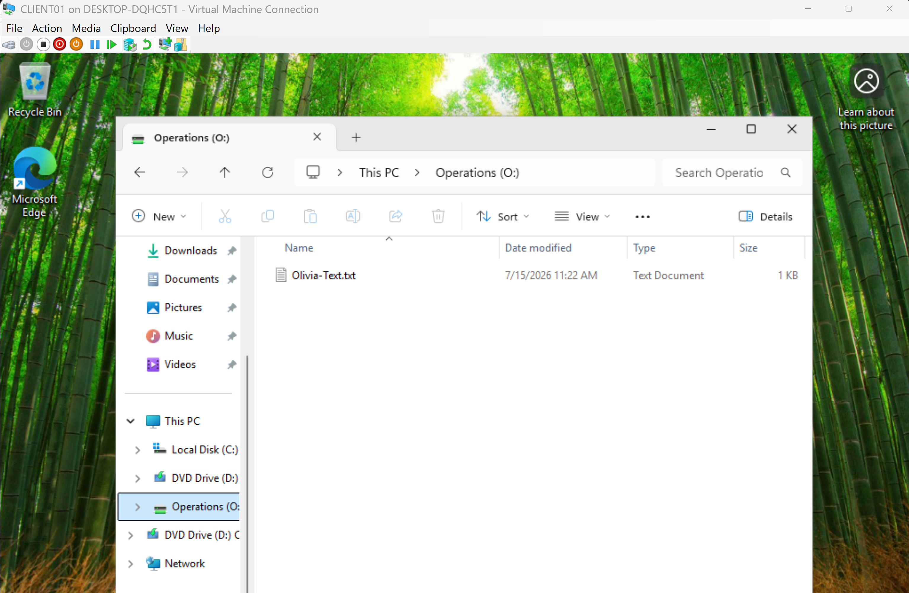
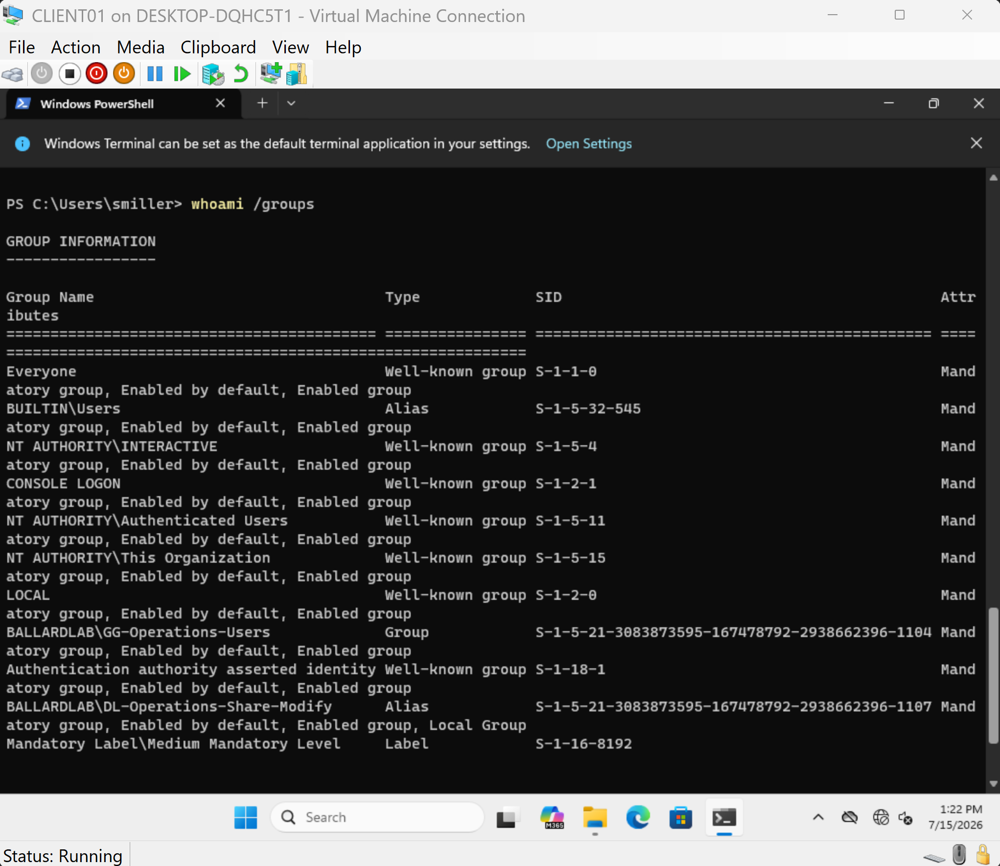
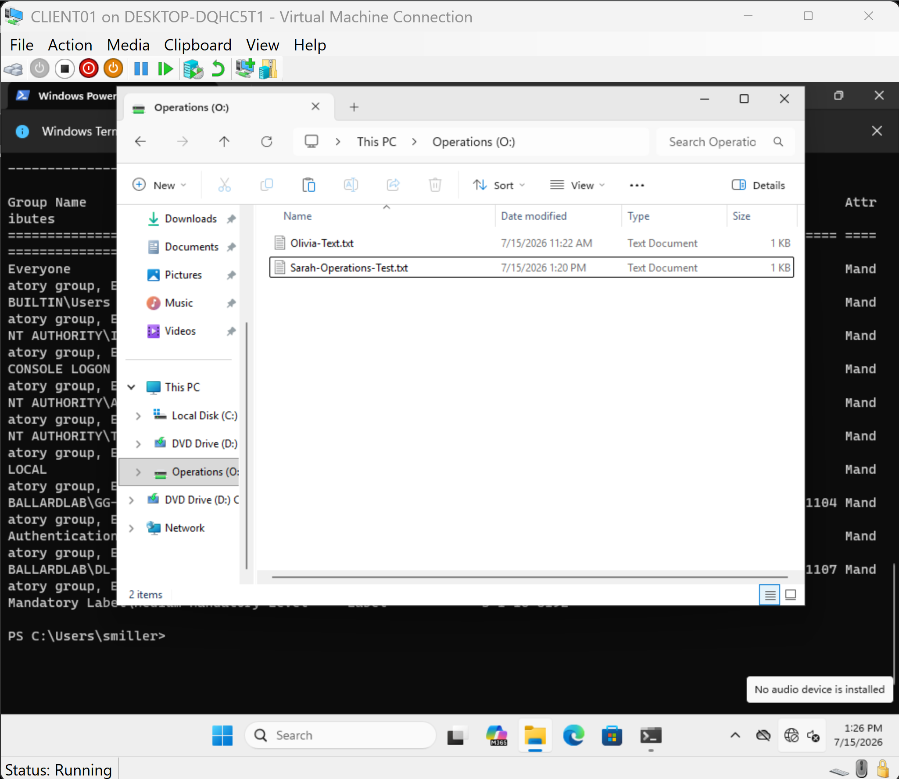
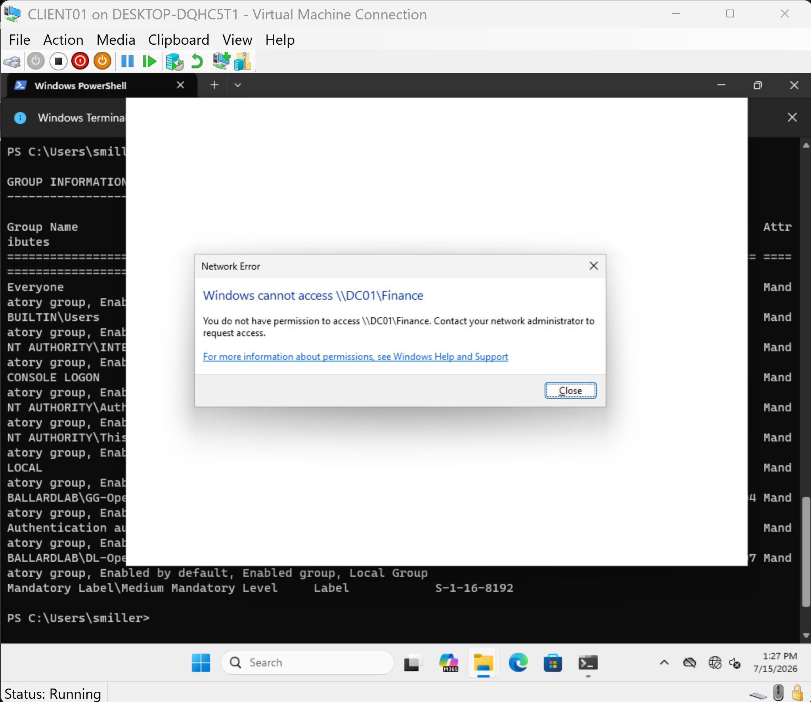

# Group Policy and Role-Based Drive Mapping

## Overview

Group Policy Preferences were implemented to automatically deploy departmental network drive mappings based on Active Directory role group membership.

The configuration provides users with the network resources associated with their organizational role while NTFS permissions independently enforce access to the underlying SMB resources.

This separates user environment configuration from resource authorization.

---

## Group Policy Design

A Group Policy Object named:

`GPO-User-Department-DriveMaps`

was created and linked to the `Users` organizational unit.

The GPO contains user configuration settings under:

`User Configuration > Preferences > Windows Settings > Drive Maps`

Because the GPO is linked to the `Users` OU, user objects within the OU and its child OUs are within the policy processing scope.

Department-specific drive mappings are then controlled through Group Policy Preferences item-level targeting.

---

## Department Drive Mappings

Two departmental drive mappings were configured.

| Department | Drive Letter | UNC Path | Target Group |
|---|---|---|---|
| Finance | `F:` | `\\DC01\Finance` | `GG-Finance-Users` |
| Operations | `O:` | `\\DC01\Operations` | `GG-Operations-Users` |

Item-level targeting evaluates the current user's Global security group membership.

For example:

`GG-Finance-Users` identifies users assigned to the Finance organizational role.

If the user is a member of this group, the Finance drive preference item applies and maps:

`F: -> \\DC01\Finance`

The same design is used for Operations users.

This allows a single GPO to provide different user configurations based on Active Directory role membership.


---

## Configuration vs Authorization

Drive mapping and resource authorization are intentionally handled as separate controls.

Group Policy Preferences determines whether a departmental drive is configured in the user's Windows environment.

NTFS permissions determine whether the user is authorized to access the underlying resource.

The design follows the following model:

`Global Group -> User Role`

`Domain Local Group -> Resource Permission`

For example:

`Sarah Miller -> GG-Operations-Users -> DL-Operations-Share-Modify -> Operations NTFS Modify`

The Group Policy Preference targets `GG-Operations-Users` because the mapping is based on the user's organizational role.

The Operations folder ACL assigns Modify permission to `DL-Operations-Share-Modify`.

This preserves the AGDLP access model while allowing Group Policy to configure the user environment.

---

## Policy Processing Validation

Policy processing was validated from the domain-joined Windows 11 client using:

```powershell
gpupdate /force
gpresult /r
```

The resulting user policy output confirmed that:

`GPO-User-Department-DriveMaps`

was successfully applied from `DC01.ballardlab.local`.

Testing with an Operations user confirmed that the Operations drive was automatically mapped while the Finance drive was not configured.





---

## Role Transfer Validation

A user role-transfer scenario was tested to validate access lifecycle management.

Sarah Miller was initially assigned to Finance through membership in:

`GG-Finance-Users`

The simulated support request transferred Sarah from Finance to Operations.

The following Active Directory changes were performed:

- Removed Sarah from `GG-Finance-Users`
- Added Sarah to `GG-Operations-Users`
- Moved the Sarah Miller user object from the Finance OU to the Operations OU

No NTFS ACL changes were required.

No drive mapping paths were manually configured on the client.

The existing group and Group Policy architecture handled the access change.

---

## Logon Token Refresh

During testing, Sarah's existing Windows session continued to display her previous Finance group membership when running:

```powershell
whoami /groups
```

Running:

```powershell
gpupdate /force
```

reprocessed Group Policy but did not rebuild the user's existing logon access token.

A complete sign-out and sign-in was required.

After a new logon session was established, `whoami /groups` showed:

- `GG-Operations-Users`
- `DL-Operations-Share-Modify`

The previous Finance groups were no longer present in the user's token.



This demonstrated the distinction between Group Policy processing and Windows logon token creation.

`gpupdate /force` reprocesses Group Policy.

A new logon session creates a fresh user access token containing current group membership.

---

## Drive Mapping Lifecycle

The initial drive mapping configuration used the Group Policy Preferences `Update` action.

During role-transfer testing, it was identified that a mapped drive could remain visible after the user no longer matched the item's security group targeting condition.

Although NTFS permissions correctly denied access to the resource, the stale drive mapping created an unnecessary user experience issue.

The drive map preferences were updated to use:

`Replace`

with:

`Remove this item when it is no longer applied`

This allows Group Policy Preferences to manage the drive mapping lifecycle.

When a user no longer matches the item-level targeting condition, the previous departmental drive mapping is removed.

When the user matches a new departmental role group, the appropriate drive mapping is deployed.


---

## Final Role Transfer Results

After Sarah signed in with a fresh logon session, Group Policy processed her new Operations role membership.

The resulting user environment contained:

`Operations (O:)`

The previous Finance `F:` drive mapping was removed.

Sarah successfully created and modified a file within the Operations share.



A direct access attempt to:

`\\DC01\Finance`

was denied.



The final validation confirmed that changing a user's Active Directory role group membership automatically updated both the user's resource authorization path and departmental drive mapping configuration.

---

## Key Technical Takeaways

- Group Policy scope determines which Active Directory objects process a GPO.
- Group Policy Preferences can configure user environments without granting resource authorization.
- Item-level targeting allows a single GPO to provide different configurations based on security group membership.
- Global groups represent organizational roles.
- Domain Local groups represent resource permissions.
- NTFS permissions remain the authorization control for SMB resources.
- `gpupdate /force` does not rebuild an existing Windows logon access token.
- Group membership changes may require a new logon session before the updated token is reflected.
- Group Policy Preferences can manage the lifecycle of departmental drive mappings when configured to remove items that no longer apply.
