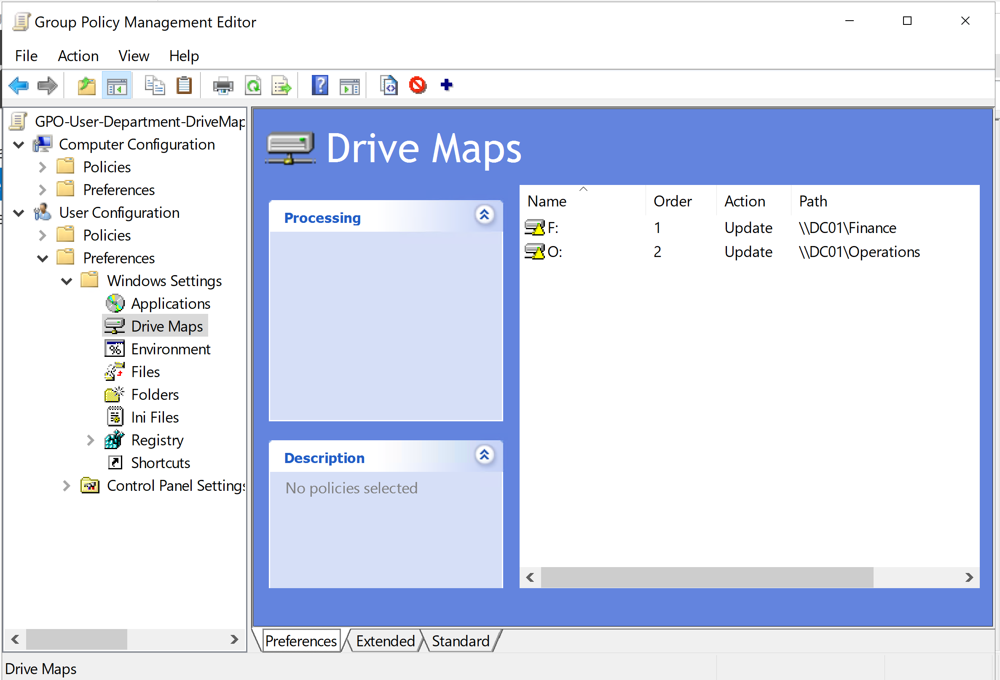

# Group Policy and Role-Based Drive Mapping

## Overview

Group Policy Preferences were implemented to automatically deploy departmental network drive mappings based on Active Directory role group membership.

The configuration provides users with the network resources associated with their organizational role while NTFS permissions independently enforce access to the underlying SMB resources.

This separates user environment configuration from resource authorization.

---

## Group Policy Design

A Group Policy Object named:

```text
GPO-User-Department-DriveMaps
```

was created and linked to the `Users` organizational unit.

The GPO contains user configuration settings under:

```text
User Configuration
    |
    v
Preferences
    |
    v
Windows Settings
    |
    v
Drive Maps
```

Because the GPO is linked to the `Users` OU, user objects within the OU and its child OUs are within the policy processing scope.

Department-specific drive mappings are then controlled through Group Policy Preferences item-level targeting.

---

## Department Drive Mappings

Two departmental drive mappings were initially configured.

| Department | Drive Letter | UNC Path | Target Group |
|---|---|---|---|
| Finance | `F:` | `\\DC01\Finance` | `GG-Finance-Users` |
| Operations | `O:` | `\\DC01\Operations` | `GG-Operations-Users` |

The initial drive map preference items used the Group Policy Preferences `Update` action.



Item-level targeting evaluates the current user's Global security group membership.

For example:

```text
GG-Finance-Users
```

identifies users assigned to the Finance organizational role.

If the user is a member of this group, the Finance drive preference item applies and maps:

```text
F: -> \\DC01\Finance
```

The same design is used for Operations users:

```text
GG-Operations-Users
        |
        v
O: -> \\DC01\Operations
```

This allows a single GPO to provide different user configurations based on Active Directory role membership.

---

## Configuration vs Authorization

Drive mapping and resource authorization are intentionally handled as separate controls.

Group Policy Preferences determines whether a departmental drive is configured in the user's Windows environment.

NTFS permissions determine whether the user is authorized to access the underlying resource.

The design follows the following model:

```text
Global Group
     |
     v
User Role
```

```text
Domain Local Group
        |
        v
Resource Permission
```

For example:

```text
Sarah Miller
      |
      v
GG-Operations-Users
      |
      v
DL-Operations-Share-Modify
      |
      v
Operations NTFS Modify
```

The Group Policy Preference targets `GG-Operations-Users` because the mapping is based on the user's organizational role.

The Operations folder ACL assigns Modify permission to:

```text
DL-Operations-Share-Modify
```

This preserves the AGDLP access model while allowing Group Policy to configure the user environment.

A mapped drive does not grant access to a resource.

The user must still possess an applicable Allow permission through the NTFS ACL.

---

## Policy Processing Validation

Policy processing was validated from the domain-joined Windows 11 client using:

```powershell
gpupdate /force
gpresult /r
```

The resulting user policy output confirmed that:

```text
GPO-User-Department-DriveMaps
```

was successfully applied from:

```text
DC01.ballardlab.local
```


Testing with an Operations user confirmed that the Operations drive was automatically mapped while the Finance drive was not configured.


This validated both GPO processing and the Finance/Operations item-level targeting conditions.

---

## Role Transfer Validation

A user role-transfer scenario was tested to validate access lifecycle management.

Sarah Miller was initially assigned to Finance through membership in:

```text
GG-Finance-Users
```

The simulated support request transferred Sarah from Finance to Operations.

The following Active Directory changes were performed:

```text
Remove: GG-Finance-Users
Add:    GG-Operations-Users
```

Sarah's user object was also moved:

```text
Finance OU
    |
    v
Operations OU
```

No NTFS ACL changes were required.

No drive mapping paths were manually configured on CLIENT01.

The existing Active Directory group, AGDLP, and Group Policy architecture was used to process the role change.

Conceptually, the authorization path changed from:

```text
Sarah Miller
      |
GG-Finance-Users
      |
DL-Finance-Share-Modify
      |
Finance NTFS Modify
```

to:

```text
Sarah Miller
      |
GG-Operations-Users
      |
DL-Operations-Share-Modify
      |
Operations NTFS Modify
```

The Finance and Operations resource ACLs remained unchanged.

---

## Logon Token Refresh

During testing, Sarah's existing Windows session continued to display her previous Finance group membership when running:

```powershell
whoami /groups
```

Running:

```powershell
gpupdate /force
```

reprocessed Group Policy but did not rebuild the user's existing Windows logon access token.

A complete sign-out and sign-in was required.

After a new logon session was established, `whoami /groups` showed:

```text
GG-Operations-Users
DL-Operations-Share-Modify
```

The previous Finance groups were no longer present in the user's token.


This demonstrated the distinction between Group Policy processing and Windows logon token creation.

```text
gpupdate /force
        |
        v
Reprocess Group Policy
```

```text
Sign out / Sign in
        |
        v
Create new logon session
        |
        v
Build new access token
        |
        v
Current group SIDs included
```

Group Policy can be reprocessed within an existing session.

Security group membership represented in the user's logon access token requires a new logon session before the updated token is reflected.

---

## Drive Mapping Lifecycle

The initial drive mapping configuration used the Group Policy Preferences `Update` action.

During role-transfer testing, Sarah's previous Finance `F:` drive remained visible after her Active Directory role was changed to Operations.

The stale drive mapping could still be selected from File Explorer.

However, attempting to access the Finance resource returned:

```text
Access Denied
```

NTFS authorization was functioning correctly because Sarah's refreshed access token no longer contained the Finance authorization group path.

The issue was therefore not an NTFS permission failure.

The issue was the lifecycle of the previously configured drive mapping.

Conceptually:

```text
Sarah removed from Finance role
             |
             v
Finance NTFS authorization removed
             |
             v
Finance resource access denied
```

But:

```text
Existing F: drive mapping
             |
             v
Remained visible in File Explorer
```

The original `Update` configuration did not provide the desired cleanup behavior for a departmental role transfer.

The drive map preference items were therefore changed to use:

```text
Replace
```

and configured with:

```text
Remove this item when it is no longer applied
```

The final managed drive map configuration was:


This allows Group Policy Preferences to manage the full lifecycle of the departmental drive mappings.

When a user matches the item-level targeting condition:

```text
Matching role group
        |
        v
Drive mapping deployed
```

When the user no longer matches the targeting condition:

```text
Role membership removed
        |
        v
Preference item no longer applies
        |
        v
Previous drive mapping removed
```

When the user is assigned to a new department:

```text
New role group membership
        |
        v
New preference item applies
        |
        v
New departmental drive mapped
```

This corrected the stale drive mapping behavior identified during role-transfer testing.

---

## Final Role Transfer Results

After Sarah signed in with a fresh logon session, Group Policy processed her current Operations role membership.

The resulting user environment contained:

```text
Operations (O:)
```

The previous Finance `F:` drive mapping was removed.

Sarah successfully accessed the Operations drive and created a test file within the resource.


A direct access attempt to:

```text
\\DC01\Finance
```

returned an authorization error.


The final validation confirmed that changing Sarah's Active Directory role group membership updated:

- The security groups represented in her Windows logon access token
- Her NTFS authorization path
- Her departmental drive mapping configuration
- Her visible user environment on CLIENT01

No individual NTFS ACL changes were required for the user.

No manual drive mapping changes were required on CLIENT01.

The group-based access and Group Policy design handled the departmental role transfer through centralized administration.

---

## Key Technical Takeaways

- Group Policy scope determines which Active Directory objects process a GPO.
- Group Policy Preferences can configure user environments without granting resource authorization.
- Item-level targeting allows a single GPO to provide different configurations based on security group membership.
- Global groups represent organizational roles.
- Domain Local groups represent resource permissions.
- NTFS permissions remain the authorization control for SMB resources.
- A visible mapped drive does not prove that a user is authorized to access the underlying resource.
- `gpupdate /force` does not rebuild an existing Windows logon access token.
- Group membership changes may require a new logon session before updated security group SIDs are represented in the token.
- The Group Policy Preferences `Update` action did not provide the desired drive cleanup behavior during the tested role transfer.
- `Replace` with `Remove this item when it is no longer applied` allowed Group Policy to manage the departmental drive mapping lifecycle.
- Role-based group administration allowed a user's department access to change without modifying the resource ACLs.

## Related Documentation

- [Network Design](01-network-design.md)
- [Active Directory](02-active-directory.md)
- [DHCP and DNS](03-dhcp-dns.md)
- [Access Control](04-access-control.md)
