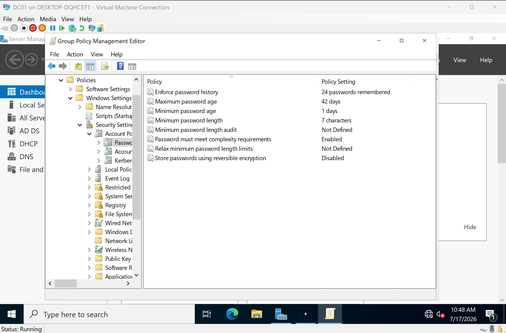
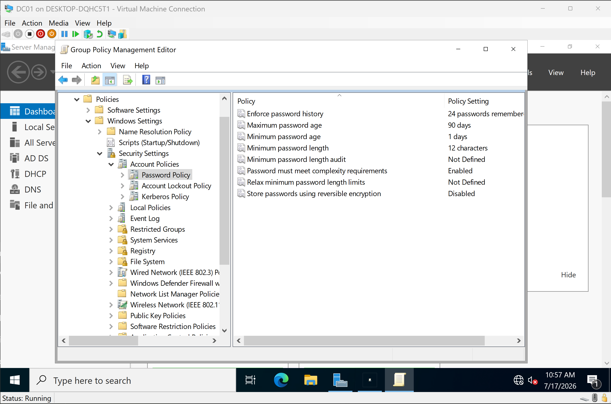
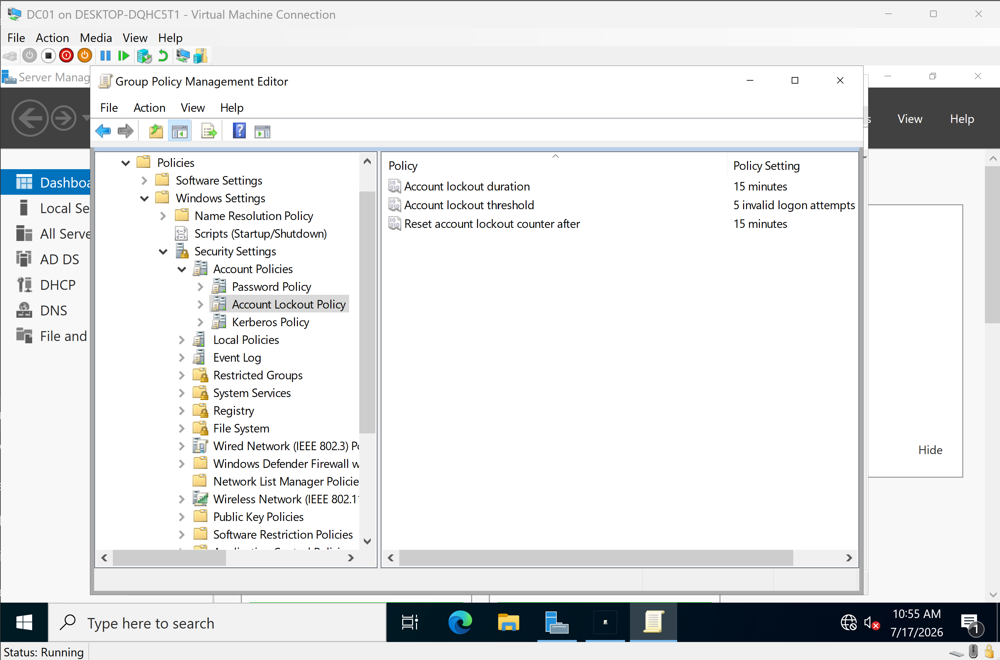
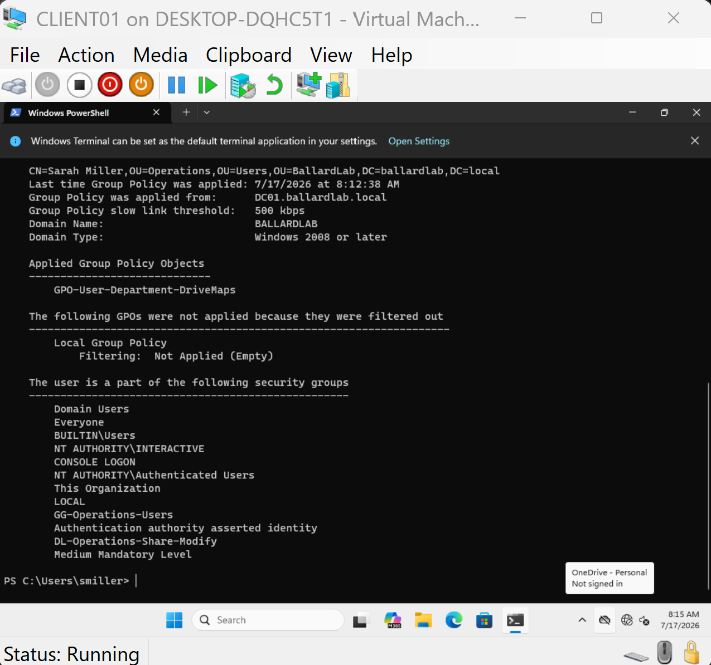
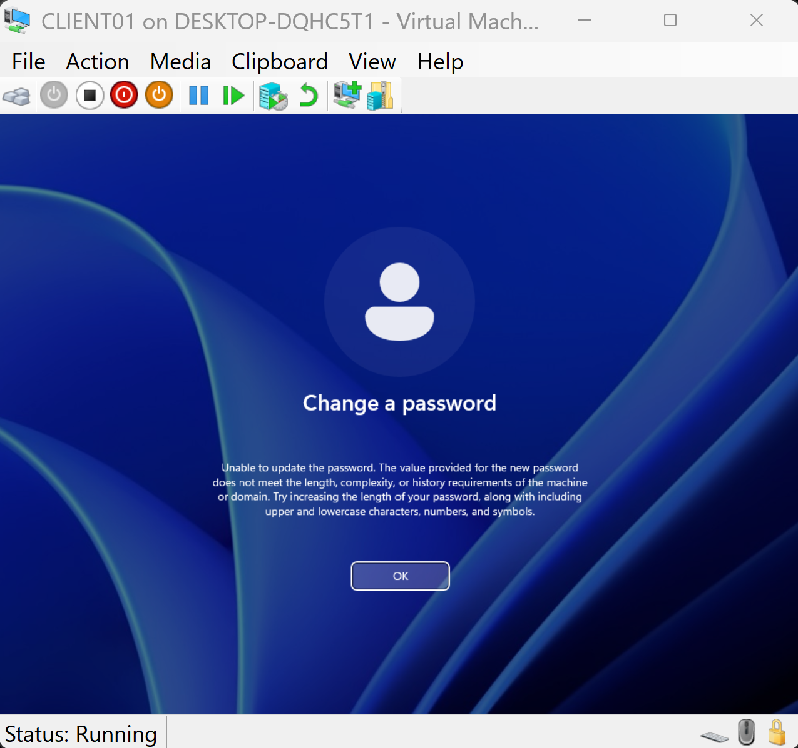
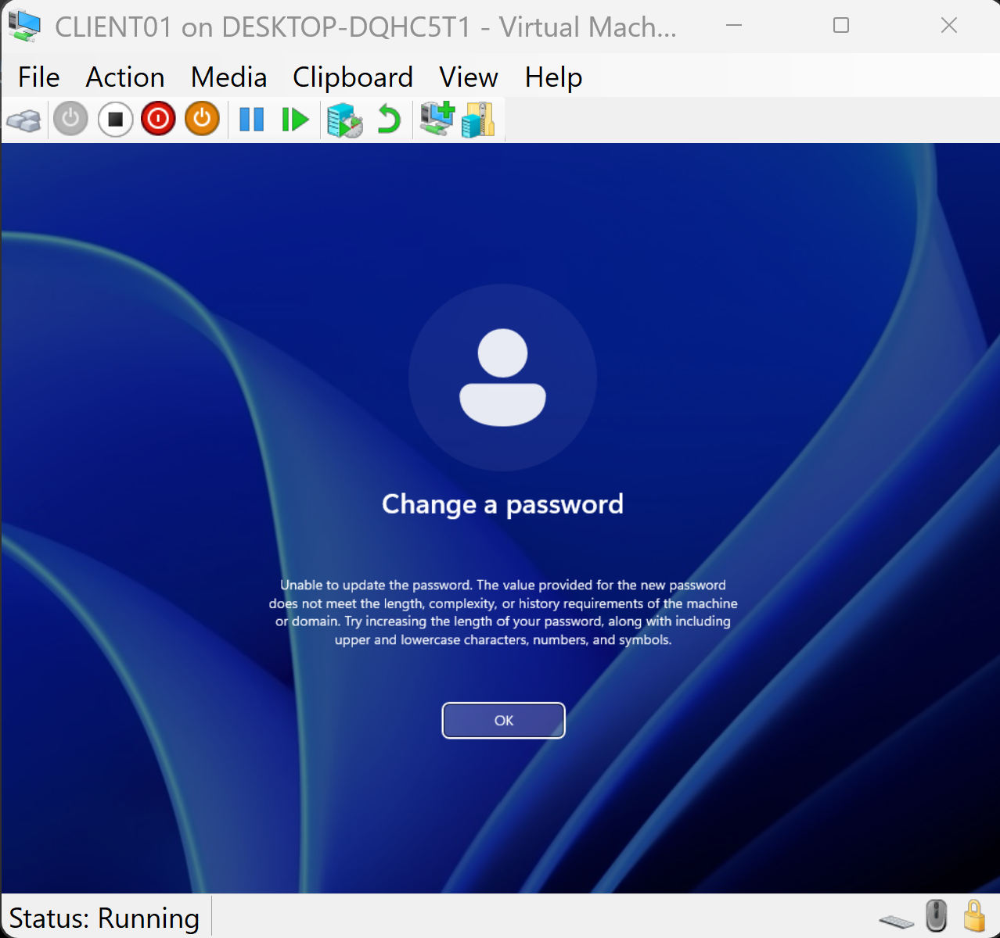
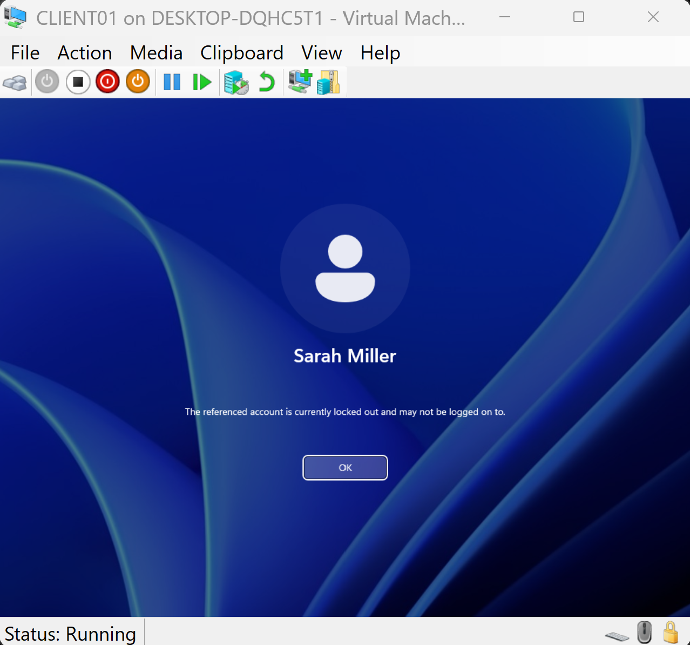
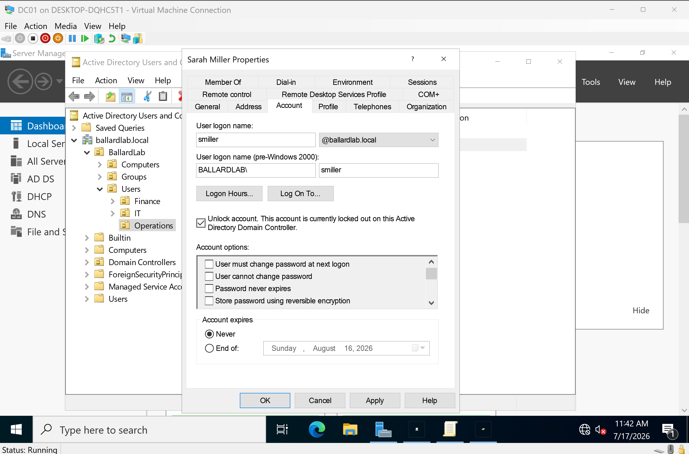

# 06 - Windows Security Policies

## Overview

This section documents the implementation and validation of domain-wide password and account lockout policies using Group Policy within the BallardLab Active Directory environment.

The objective was to establish a basic enterprise security baseline while validating that the configured policies were successfully applied and enforced on a domain-joined Windows 11 client.

---

# Environment

| Component | Value |
|-----------|-------|
| Domain | ballardlab.local |
| Domain Controller | DC01 |
| Client | CLIENT01 |
| Server OS | Windows Server 2022 |
| Client OS | Windows 11 Pro |

---

# Password Policy

The Default Domain Policy was configured with the following settings.

| Policy | Configuration |
|--------|---------------|
| Enforce password history | 24 passwords remembered |
| Maximum password age | 90 days |
| Minimum password age | 1 day |
| Minimum password length | 12 characters |
| Password must meet complexity requirements | Enabled |
| Store passwords using reversible encryption | Disabled |

### Default Password Policy (Before)



### Configured Password Policy



---

# Account Lockout Policy

The following account lockout settings were configured to protect against password guessing and brute-force attacks.

| Policy | Configuration |
|--------|---------------|
| Account lockout threshold | 5 invalid logon attempts |
| Account lockout duration | 15 minutes |
| Reset account lockout counter | 15 minutes |

### Configured Account Lockout Policy



---

# Policy Validation

## Group Policy Application

The client was refreshed using Group Policy and verified using:

```cmd
gpresult /r
```

The Default Domain Policy was successfully applied to the domain-joined client.



---

## Password Complexity Validation

An attempt was made to change the user's password to a weak password that did not satisfy the configured requirements.

Windows rejected the request, confirming enforcement of the domain password policy.



---

## Password History Validation

After successfully changing the user's password to a compliant value, an attempt was made to reuse the previous password.

Windows rejected the password change, confirming password history enforcement.



---

## Account Lockout Validation

Five consecutive failed logon attempts were performed against the domain account.

The account was successfully locked in Active Directory and required administrative intervention to restore access.

### Locked Account



### Administrative Unlock



After unlocking the account within Active Directory Users and Computers, the user successfully authenticated using the correct password, confirming the complete lockout and recovery workflow.

---

# Skills Demonstrated

- Active Directory Domain Services (AD DS)
- Windows Server 2022 Administration
- Group Policy Management
- Password Policy Configuration
- Account Lockout Policy
- Windows Authentication
- Active Directory Users and Computers (ADUC)
- Enterprise Security Baselines
- Security Policy Validation
- Identity and Access Management (IAM)

---

# Outcome

A domain-wide Windows security baseline was successfully implemented and validated using Group Policy.

Password complexity, password history, account lockout behavior, and administrative account recovery were all verified on a Windows 11 domain client, demonstrating common identity security tasks performed by Windows Systems Administrators.
