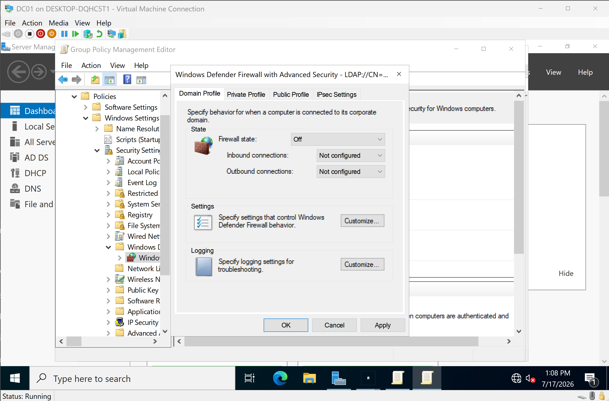
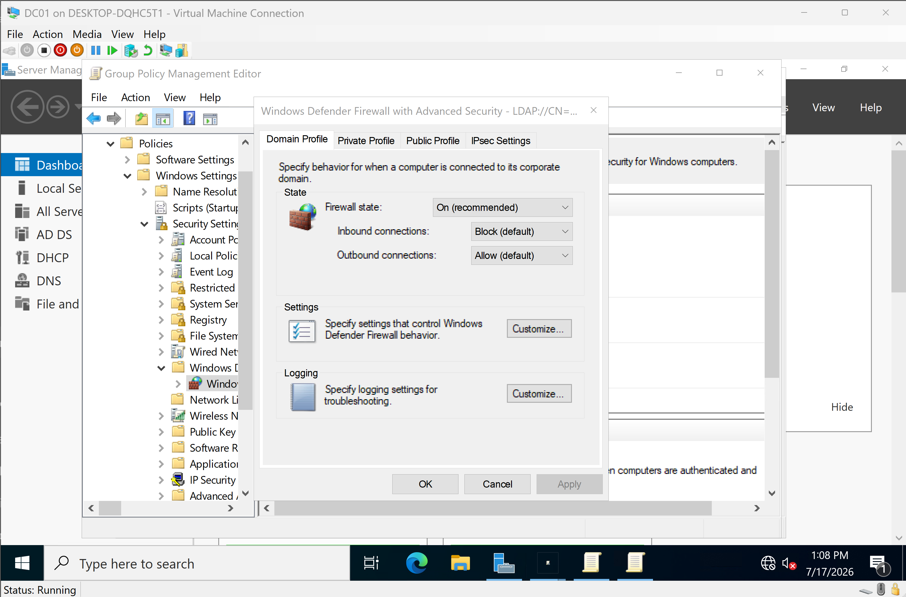
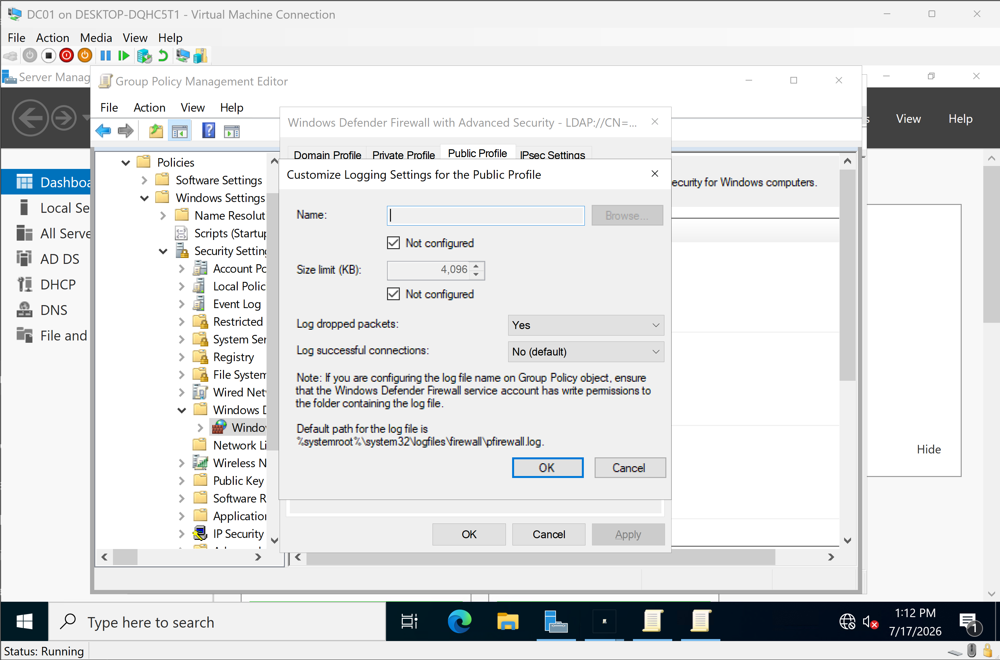
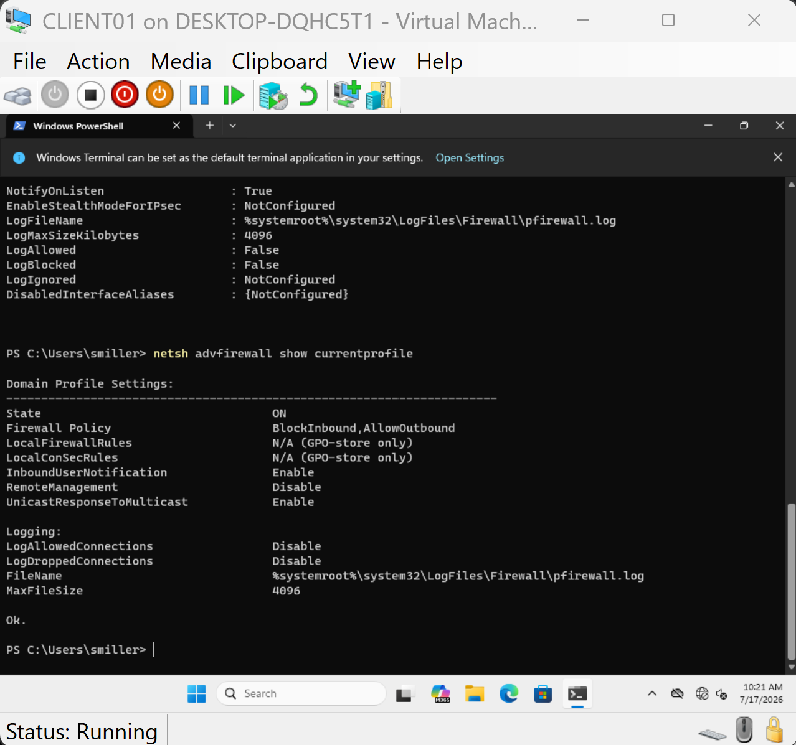

# Windows Defender Firewall Policy

## Overview

This section documents the implementation and validation of a centralized Windows Defender Firewall baseline using Group Policy within the BallardLab Active Directory environment.

The objective was to deploy a consistent firewall configuration across domain-joined systems while maintaining normal Active Directory communication and enterprise networking functionality.

---

# Objectives

- Configure Windows Defender Firewall using Group Policy
- Enable the firewall for all network profiles
- Configure default inbound and outbound behavior
- Configure firewall logging
- Validate policy deployment on a domain client
- Verify the active firewall profile

---

# Environment

| Component | Value |
|-----------|-------|
| Domain | ballardlab.local |
| Domain Controller | DC01 |
| Client | CLIENT01 |
| Server OS | Windows Server 2022 |
| Client OS | Windows 11 Pro |

---

# Firewall Configuration

Windows Defender Firewall was configured through the **Default Domain Policy** using Windows Defender Firewall with Advanced Security.

The following baseline was applied to the Domain, Private, and Public profiles.

| Setting | Configuration |
|----------|---------------|
| Firewall State | On |
| Inbound Connections | Block (Default) |
| Outbound Connections | Allow (Default) |
| Display Notifications | Disabled |

This configuration provides a secure enterprise baseline by preventing unsolicited inbound traffic while allowing users and services to initiate outbound connections.

### Default Configuration



### Configured Firewall Policy



---

# Firewall Logging

Firewall logging was configured to improve troubleshooting and security visibility.

| Setting | Configuration |
|----------|---------------|
| Log Dropped Packets | Yes |
| Log Successful Connections | No |
| Maximum Log Size | 4096 KB |

Logging dropped packets provides useful troubleshooting information without generating excessive log data from successful connections.



---

# Policy Validation

After updating Group Policy on CLIENT01, the active firewall profile was validated.

Validation confirmed:

- Windows Defender Firewall enabled
- Domain Profile active
- Default inbound traffic blocked
- Default outbound traffic allowed
- Firewall configuration applied through Group Policy

Validation command:

```cmd
netsh advfirewall show currentprofile
```

Validation confirmed:

```text
State: ON
Firewall Policy: BlockInbound, AllowOutbound
```



---

# Skills Demonstrated

- Windows Defender Firewall
- Group Policy Management
- Windows Server 2022 Administration
- Windows Security Baselines
- Enterprise Firewall Configuration
- Windows Client Management
- Group Policy Validation
- Command Line Administration
- Infrastructure Documentation

---

# Outcome

A centralized Windows Defender Firewall baseline was successfully deployed using Group Policy.

Firewall policy was validated from a domain-joined Windows client to confirm that enterprise firewall settings were applied correctly while maintaining normal Active Directory functionality.

This implementation demonstrates foundational Windows endpoint security administration commonly performed by Windows Systems Administrators.
